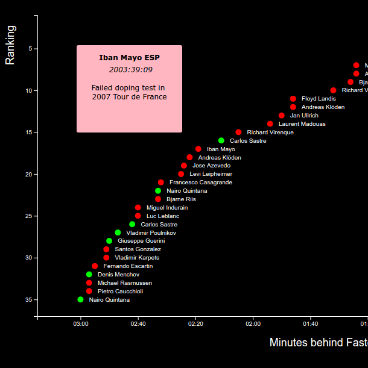

# D3 Scatterplot Graph

## Description

This project uses d3.js to display a scatterplot of the 35 fastest times up Alpe d'Huez normalized to 13.8km distance. It displays each cyclist with a red or green plot point. A red plot point indicates the cyclist was caught doping at some point in the career while green means they have not.

When a user places the cursor over one of the plot points a tooltip will be displayed indicating the year and recorded time of the cyclist. If the plot point is red it will also provide a brief description on the cyclist's doping infraction.

## Live Demo

https://coymeetsworld.github.io/d3-scatterplot-graph

	

## About

This project was written by Coy Sanders as a requirement in the [Data Visualization Projects](https://www.freecodecamp.com/challenges/visualize-data-with-a-scatterplot-graph) for [FreeCodeCamp](http://www.freecodecamp.com) to earn the Data-Visualization Development Certification.

software is licensed under the 

Copyright (c) 2017 
